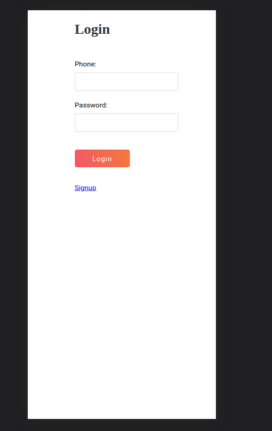
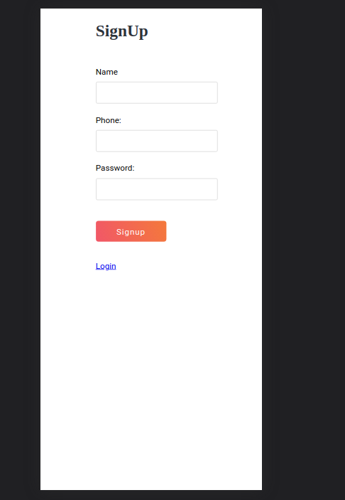
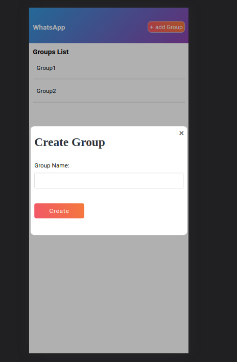
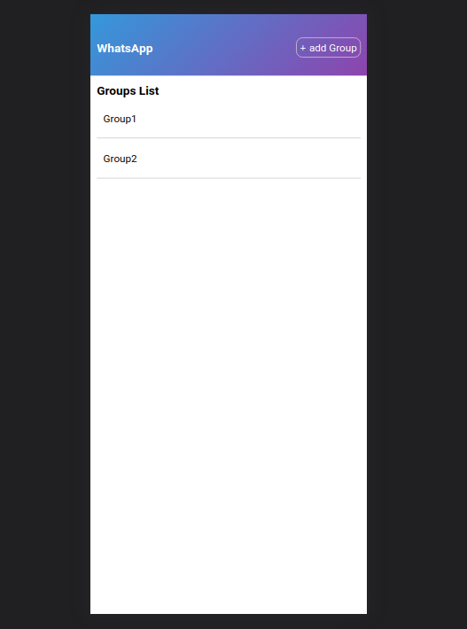
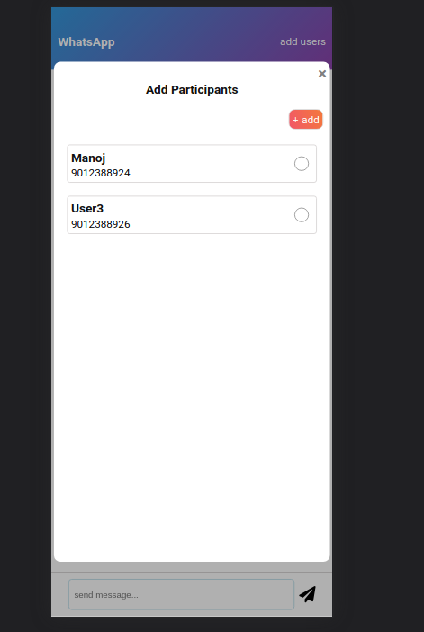
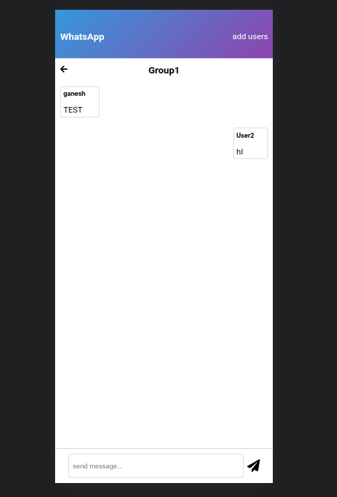

# chatapp

##### node version 18 required

### BACKEND SETUP
#### path {root/chat-app-backend}
#### 1. INSTALL MONGODB ON YOUR MACHINE
#### 2. CREATE .env file from envsample
#### 3. install package
#### 4. npm run start

### FRONEND SETUP
#### path {root/chat-app-frontend}
### 1. CREATE .env file from envsample
### 2. install packages
### 3. npm start

### Login Screen

### signup Screen

### crate Group Screen

### group List Screen

### add Member To Group Screen

### group chat Screen
